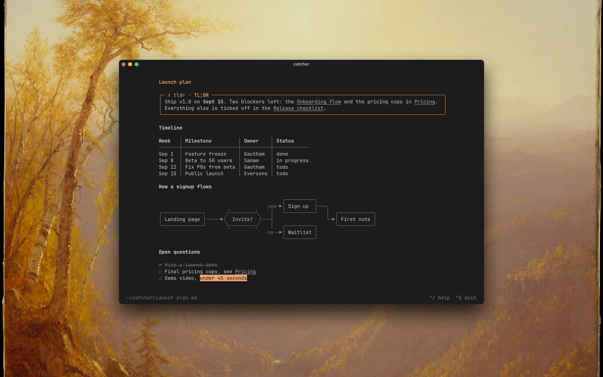

# catcher

A minimal note-taking app for the terminal. Local-first, no accounts, no sync: your notes are a folder of `.md` files in `~/catcher`, so `grep`, git and Obsidian work on them too.



<sub>Background: Sanford Robinson Gifford, <i>A Gorge in the Mountains (Kauterskill Clove)</i>, 1862. The Metropolitan Museum of Art, public domain.</sub>

> Called **tinynote** until 0.9. Existing `~/tinynote` and `~/.config/tinynote` folders are still picked up.

## Install

```
brew install gautham-v/tap/catcher
```

or `cargo install catcher`. Then run `catcher`.

## Using it

- **^K** is the command palette: new, open, delete, rename, move to folder, reading view, help, settings, quit.
- **^O** opens a note: every folder, most recently opened first, fuzzy-searched by filename. **Tab** steps through its tabs: recent, a folder tree, and contents.
- **⇧^F** searches in all files: every line that has every word you type, grouped by note. **⏎** opens the note at that line.
- **⌥⏎** on a row in **^O** or **⇧^F** opens that note in a terminal split to the right and leaves this one where it is; **⌥⇧⏎** splits below, **⌘⏎** opens a tab, and **⌥click** does the same as **⌥⏎**. The palette has *open in split right / down / new tab* for the note you are in. Catcher asks the terminal: Ghostty 1.3+ (through AppleScript; macOS asks once whether catcher may control it), tmux, kitty and WezTerm. Elsewhere the status bar says so.
- **^N** makes a note. The filename follows its first line until you rename the file yourself. Either way, `[[links]]` to the old name in other notes are rewritten to the new one.
- **⌥D** opens today's note, `journal/2026-09-01.md`, made from `journal/template.md` the first time (`{{title}}`, `{{date}}`, `{{yesterday}}`, `{{tomorrow}}`) and never rewritten after.
- The palette also has editing commands, unbound until you give them a key: toggle checkbox (`- item` → `- [ ]` → `- [x]` → `- item`, numbered lists too), move line up / down, toggle heading (`#`, `##`, `###`, none), insert today's date, copy path, reveal in Finder. Each takes the selection when there is one, and undoes as one step.
- **^P** flips between the live-preview editor and the rendered page. Images draw inline in Ghostty, kitty and iTerm2, whether written `` or as an Obsidian embed, `![[path]]` or `![[path|alt]]`. In the reading view a click on a picture takes the whole terminal with it; **←** / **→** step between the note's pictures, and any other key or a click puts the page back.
- `[[wikilinks]]` work like Obsidian's. **⌥⏎** follows one, **⌥P** peeks at it, **^B** / **^F** go back and forward. A link to a note that does not exist yet is grey; following it makes the note beside the one you are in. `[[Note#Heading]]` reads as `Note › Heading` and lands on that heading; `[[Note#^id]]` lands on the line ending in ` ^id`; `[[#Heading]]` jumps within the note. Links resolve through a note's front matter `aliases:` too. The reading view lists the notes that link here at the bottom, and the notes that mention this one's title without linking it.
- `![[Note]]`, `![[Note#Heading]]` or `![[Note|label]]` on a line of its own embeds the note: a card with its title, the first lines of its body or of that section, and how many more there are. In a sentence it is a link.
- `#tags` are coloured, inline or as front matter `tags:`. **⌥⏎** or a click on one opens **^O** cut to the notes that carry it.
- A ` ```mermaid ` fence is drawn as text: flowcharts and sequence diagrams, in box-drawing characters, no images and no network. Other kinds keep their source under a label.
- Callouts, front matter, tables wider than the page (they pan sideways), checkboxes and `==highlights==` all render. Callouts fold (`> [!kind]- Title` starts folded, **⌥←** / **⌥→** or a click toggles) and nest. The reading view draws front matter as a properties box, tags clickable and dates with a relative hint.
- Tasks: `1. [ ]` numbered tasks get a checkbox, and the `[/]` in progress, `[-]` cancelled, `[>]` forwarded and `[?]` question states draw as glyphs. Nested bullets alternate `•`, `◦`, `▪`.
- Also rendered, both views: `%% comments %%` (dimmed in the editor, gone from the page), inline footnotes `^[text]` numbered with `[^n]` references, and the HTML notes actually use — `<kbd>`, `<sub>`, `<sup>`, `<u>`, `<mark>`, `<br>`, `<!-- comments -->`. The editor shows backslash escapes literally, a dim `↵` for a hard line break, setext headings and indented code.
- **Outline** in the palette (rebindable as `key_outline`) lists the note's headings: type to filter, **⏎** jumps, **⌥⏎** folds the section.
- Sections fold. On a heading, **⌥←** folds everything under it down to the next heading of the same or a higher level, **⌥→** opens it again; a folded heading shows `▸` and how many lines it hides. Folds are per note and last for the session, and the reading view keeps them: a click on a heading there folds or unfolds it, and **⌥←** / **⌥→** take the heading the selection is on, or the first one on screen.
- Notes autosave. Edit a note in another program and catcher takes what is on disk: the buffer reloads, the cursor stays on its line, and **^Z** brings the old buffer back. A file deleted from under it is said so in the status bar and recreated on the next save.
- Mouse works: click, drag to select and copy, scroll. **^V** pastes a clipboard image as a PNG.

## CLI

```
catcher                  open the note you last had open
catcher groceries        open the note whose title best matches; an error if none does
catcher new groceries    create a note titled "groceries" and open it
catcher today            open today's note in `journal/`, creating it from the template
catcher add "buy milk"   write a new note and print its path
catcher ~/vault          open the TUI rooted at that folder
catcher ~/vault/a.md     open that note, rooted at its folder
catcher path             print the notes directory
catcher --version        print the version
```

## Keys

| Key | Action |
| --- | --- |
| `^K` | Command palette |
| `^O` | Open a note (`Tab` for the folder tree, again for contents) |
| `⇧^F` | Search in all files |
| `^N` | New note |
| `⌥D` | Today's note |
| `^P` | Reading view |
| `^S` | Save now |
| `^Z` / `^Y` | Undo / redo |
| `^C` `^X` `^V` | Copy / cut / paste |
| `⌥⏎` / `⌥P` | Follow / peek at the `[[wikilink]]` under the cursor (a missing note is created; `⌥⏎` follows a `#tag` too) |
| `^B` / `^F` | Back / forward |
| `⌥←` / `⌥→` | On a heading: fold / unfold the section (elsewhere: by word) |
| `^/` or `F1` | Help card |
| `^,` | Settings |
| `^Q` | Quit |

Editing is macOS-style: `⌘←`/`⌘→` line ends, `⌥←`/`⌥→` by word, `⇧` to extend a selection, `⌘A` select all. Every key is rebindable in the settings; `^K` answers to ctrl or cmd. `⇧^F` needs a terminal that tells shift+ctrl apart (Ghostty, kitty, WezTerm); elsewhere it arrives as `^F` and the palette is the way in. The editing commands ship with no key: `key_checkbox`, `key_line_up`, `key_line_down`, `key_heading`, `key_date`, `key_copy_path`, `key_reveal` bind them, and `key_split_right`, `key_split_down`, `key_new_tab` the open-beside ones.

## Settings

**^,** opens `~/.config/catcher/settings.md` as a note; **^S** applies it. It covers the notes and attachments folders, the daily note's folder and template, theme (`auto`, `dark`, `light`) and colours, page width, borders, status bar, autosave delay, tab width, front matter, table style, wikilinks, whether a rename updates links, linked mentions, how far **^O** looks, and every key binding (`key_fold`, `key_unfold`, and the unbound `key_fold_all` / `key_unfold_all` among them). Each line has a one-line hint beside it. `CATCHER_DIR` overrides the notes folder.

## Development

```
cargo run      # against ~/catcher (set CATCHER_DIR to test elsewhere)
cargo test
cargo clippy
```

Rust, ratatui + crossterm. `src/editor.rs` is the buffer, `src/md.rs` live-preview styling, `src/render.rs` the reading view, `src/mermaid/` the diagram renderer, `src/config.rs` the settings note. Every colour lives in the `theme` module at the top of `src/md.rs`.

## License

MIT
